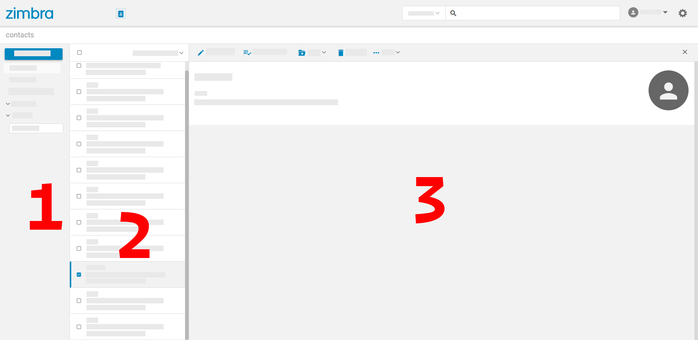

== Contacts
This section familiarizes you with {product-name}'s contacts tab interface. Click btn:[Contacts] tab to bring up the following interface.

.Contacts tab

It has

. A left pane
. A contacts pane.
. A contact details or edit pane.

=== Left Pane

. This pane lists your contact folders and contact lists. You also see folders you create and those shared with you, including:
 Contacts:: It shows all your contacts that you have added manually.
 Deleted Contacts:: It lists contacts that you have deleted.
 Emailed Contacts:: It lists contacts to whom you have sent an email.
+
NOTE: {product-name} Enterprise users see a fourth folder -- Global Address List. This folder lists all the contacts in your organization.

. Your contact lists appear nested under their respective folder.
. A blank field on the bottom helps you create lists.
These lists are especially helpful when you regularly send emails to a specific group of people.
Refer to <<contacts-manage-groups.adoc#_manage_contact_lists, Manage Contact Lists>>.

=== Contacts Pane

Whenever you click on one of the Contacts folders, or lists, from the left pane, this pane lists all contacts from the selected item.

Right-click any listed contact to see further options like **Edit**, **Delete**, **Add to Lists**, and **Share**.

=== Contact Details Pane

When a contact is selected, this pane displays its details.

This pane offers options like **Edit Details**, **Delete**, *Print*, and **Assign to Lists**.