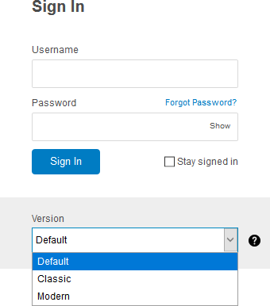

== Login
This section familiarizes you with {product-name}'s login interface.

NOTE: Contact the {product-name} administrator for the login URL and credentials.

.{product-name} login page

{product-name} client has two versions -- *Modern* and *Classic*.
A *Default* option also appears in the version drop-down.
After login, you can choose either *Modern* or *Classic* to be the default client.

. Type the URL in a browser's address bar.
. Enter your username in the *Username* field.
. Enter the password in the *Password* field.
. Choose *Modern* from the *Version* drop-down to experience the all new {product-name} email.
. Check the box *Stay signed in* to avoid entering your password each time you launch {prodcut-name}.
. Click *Sign In* to login.